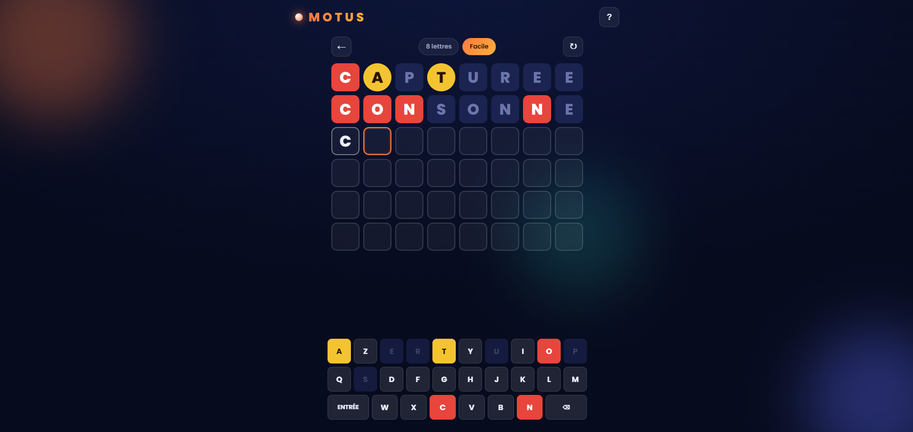

<h1 align="center">
  
</h1>


---

# Motus — Le jeu de mots

## Aperçu
Jeu de mots web à la française, façon **Motus**, en **HTML / CSS / JavaScript pur** — sans dépendance, sans serveur, jouable hors ligne. Devinez le mot mystère en 6 essais : la première lettre est offerte, chaque proposition colore la grille (bien placé / mal placé / absent). Le joueur choisit la **longueur du mot** (6 à 9 lettres) et la **difficulté** (très facile → très difficile) avant de lancer la partie.

## Fonctionnalités

### Le jeu
- **6 essais** pour trouver le mot caché, **première lettre offerte** et verrouillée à chaque ligne
- Code couleur Motus authentique après chaque proposition :
  - 🟥 **carré rouge** — lettre bien placée
  - 🟡 **rond jaune** — lettre présente mais mal placée
  - 🟦 **bleu** — lettre absente du mot
- **Gestion correcte des lettres en double** : une lettre n'est marquée « présente » qu'autant de fois qu'elle apparaît réellement dans le mot
- **Validation des propositions** : seuls les vrais mots français (longueur correcte) sont acceptés — un mot inconnu est refusé avec animation de secousse
- Animation de **retournement** des cases à la révélation, ligne par ligne
- Modale de fin de partie (gagné / perdu) affichant le mot et le nombre d'essais

### Mots & difficulté
- **850 mots français** classés par longueur et par difficulté :

  | Longueur | Mots | par catégorie |
  |----------|------|---------------|
  | 6 lettres | 200 | 40 |
  | 7 lettres | 200 | 40 |
  | 8 lettres | 200 | 40 |
  | 9 lettres | 250 | 50 |

- **5 catégories** par longueur : très facile, facile, moyen, difficile, très difficile
- Difficulté graduée par **fréquence d'usage réelle** : les mots les plus courants sont les plus faciles, les plus rares les plus difficiles (`MAISON` → `VASSAL`, `TELEPHONE` → `PAROXYSME`)
- Dictionnaire de validation de **~125 000 mots français** (longueurs 6 à 9) pour vérifier les propositions du joueur
- Listes régénérables via `build_words.py` à partir d'une liste de fréquence + un dictionnaire français

### Clavier
- **Clavier AZERTY virtuel** à l'écran, touches qui se colorent selon les lettres trouvées (rouge > jaune > bleu, jamais de rétrogradation)
- Support complet du **clavier physique** (lettres, Entrée, Retour arrière)

### Interface
- **Responsive** — adapté du grand écran au mobile : la grille et le clavier se redimensionnent automatiquement selon la longueur du mot
- Thème sombre soigné : dégradés, orbes floutés, effet de verre dépoli (glassmorphism)
- Écran d'accueil pour choisir longueur + difficulté
- Modale de **règles du jeu** accessible à tout moment
- Indication en direct de la longueur et de la difficulté en cours de partie

### Hors ligne
- 100 % statique : aucune connexion réseau requise une fois la page chargée
- Données (mots + dictionnaire) embarquées directement dans le code — aucun appel serveur

## Technologies
- **HTML5 / CSS3 / JavaScript** vanilla (aucun framework, aucune dépendance)
- Police **Poppins** (Google Fonts)
- **Python** (script `build_words.py`) pour la génération des listes de mots
- Sources de données : [liste de fréquence OpenSubtitles](https://github.com/hermitdave/FrequencyWords) + [dictionnaire an-array-of-french-words](https://github.com/words/an-array-of-french-words)
- GitHub Pages (hébergement statique — aucun serveur)

## Installation

**Aucune installation nécessaire.** Le jeu est entièrement statique.

Ouvrez simplement `index.html` dans un navigateur, ou servez le dossier :

```bash
python -m http.server 8123
# puis ouvrez http://localhost:8123
```

## Structure du projet
```
Motus/
  index.html          → Structure de la page
  style.css           → Thème sombre, design responsive
  script.js           → Logique du jeu (grille, clavier, scoring)
  words.js            → 850 mots à deviner (par longueur / difficulté)
  dico.js             → Dictionnaire de validation (~125 000 mots)
  words.json          → Listes de mots au format JSON
  build_words.py      → Script de génération des listes
  assets/
    images/github/    → Images README
```

## Les données : mots & difficulté

`words.js` expose un objet `WORDS` indexé par longueur puis par catégorie de difficulté :

```js
WORDS = {
  "6": { tres_facile: [...40], facile: [...40], moyen: [...40],
         difficile: [...40], tres_difficile: [...40] },
  "7": { ... }, "8": { ... },
  "9": { tres_facile: [...50], ... tres_difficile: [...50] }
}
```

`dico.js` expose `DICO`, un dictionnaire de validation : un `Set` de mots par longueur,
utilisé pour vérifier que chaque proposition est un vrai mot français.

```js
DICO["7"].has("COULEUR") // → true
```

## Aperçu de l'interface


## Auteur
- [Pierre-Portfolio](https://github.com/Pierre-Portfolio/)

---

<p align="center">Projet réalisé en 2026.</p>
